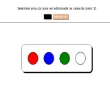

<h1>Background color switcher</h1>

<h2>Tecnologias utilizadas:</h2>

Foram utilizadas as seguintes tecnologias: HTML, CSS e JS.

<h2>Tela</h2>
<a href="https://cleytonjesus07.github.io/change-background/"> Clique para acessar o projeto</a>
 

